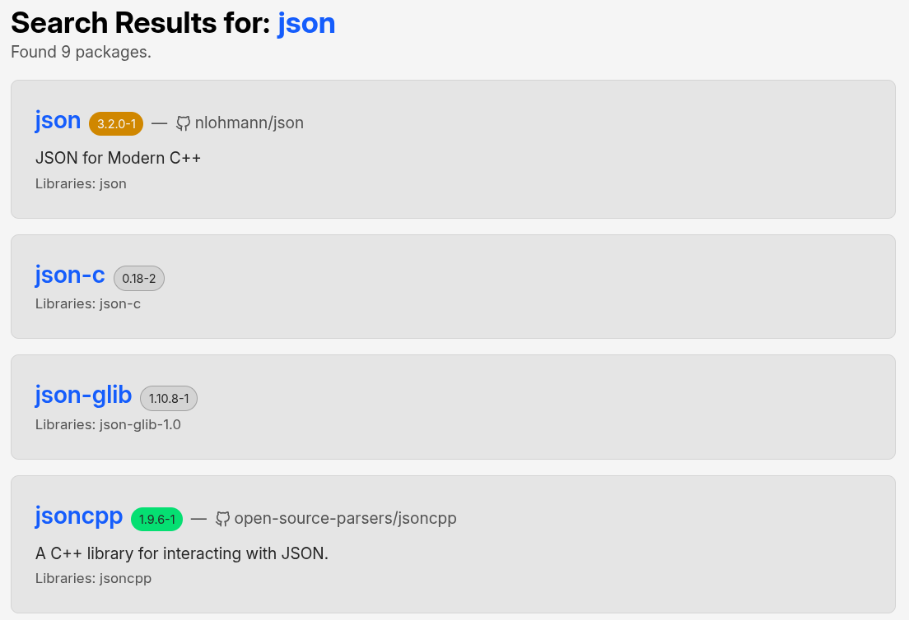
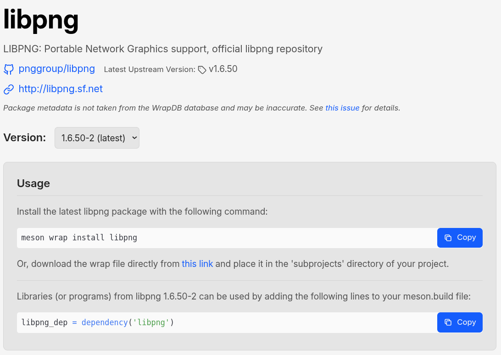
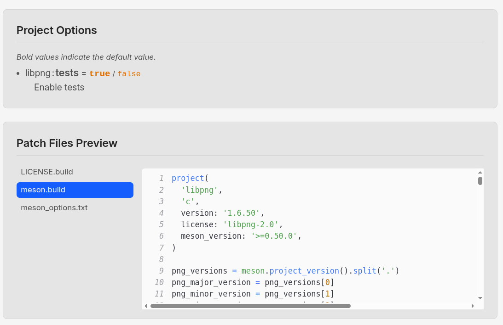

# wrapdb-browser

Unofficial browser for WrapDB packages.
https://wrapdb.natrium144.org/

## Features

### Searching packages

- Search by package name or dependency/program names.
- Displays upstream repositories and descriptions (may be incomplete for some packages).



### Viewing package details

- Copy-and-paste installation and usage guide.
- Browse patch files without installation or downloads.




## Development

Install Node.js.

Put the following environment variables in a `.env` file:

```env
ENABLE_INITDB=1
```

Install dependencies, create database and start the development server:

```sh
npm ci
npx wrangler d1 migrations apply wrapdb --local
npm run dev
```

Initialize database by accessing `http://localhost:5173/init_db` in yout browser first.
Then you can access the main page at `http://localhost:5173/`.

If you get ratelimited by GitHub, put your GitHub personal access token in the `.env` file:

```env
GITHUB_PAT=your_token
```

PRs are welcome!

## Disclaimer

This project is not affiliated with the official WrapDB or Meson projects.

The logo of this project is not based on the official Meson logo and is not affiliated with or endorsed by the Meson development team.
